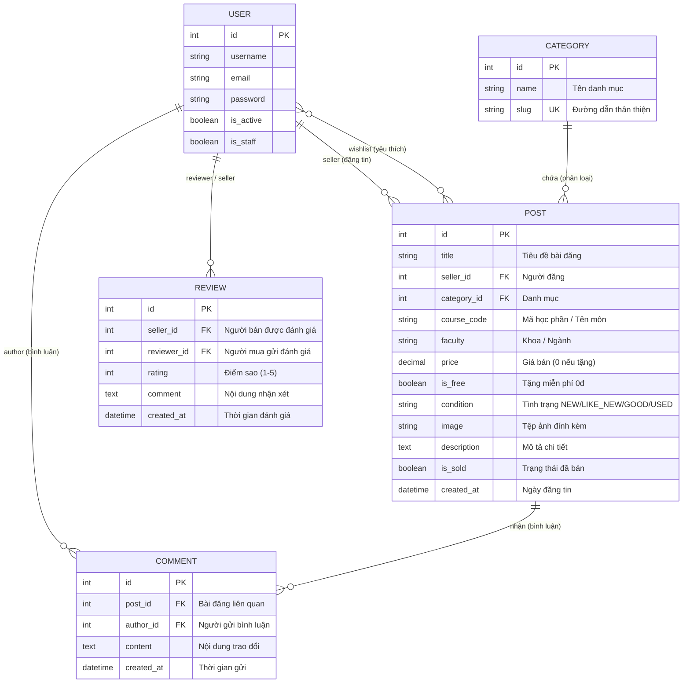
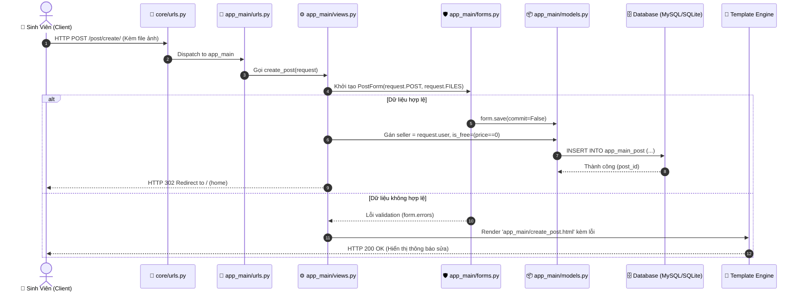

# 🏛️ Kiến Trúc Hệ Thống SáchGóc Uni (System Architecture)

> **Tài liệu đặc tả kiến trúc phần mềm, luồng dữ liệu và thiết kế thành phần dành cho GitDiagram và các công cụ trực quan hóa mã nguồn.**

---

## 1. Tổng Quan Phân Định Kiến Trúc Trước - Sau (Frontend vs Backend)

Hệ thống **SáchGóc Uni** được thiết kế phân chia tách bạch tuyệt đối giữa **Phần Trước (Frontend / Giao diện phía người dùng)** và **Phần Sau (Backend / Xử lý nghiệp vụ & Cơ sở dữ liệu)**:

```mermaid
graph TB
    %% ==========================================
    %% PHẦN TRƯỚC: FRONTEND / GIAO DIỆN CLIENT
    %% ==========================================
    subgraph FRONTEND ["🌐 PHẦN TRƯỚC (FRONTEND / CLIENT TIER)"]
        Browser["👤 Sinh viên & Trình duyệt Web"]
        TailwindCSS["Tailwind CSS 3.x UI"]
        
        subgraph Templates_Group ["Các Trang Giao Diện (app_main/templates/)"]
            TplBase["base.html (Khung chung: Header, Nav, Footer)"]
            TplHome["home.html (Trang chủ, Lọc danh mục, 0đ)"]
            TplDetail["detail.html (Xem bài, Bình luận, Nút mua)"]
            TplCreate["create_post.html (Form đăng bài, Tải ảnh)"]
            TplMyPosts["my_posts.html (Quản lý tin đăng cá nhân)"]
            TplAuth["login.html / register.html (Đăng nhập/ký)"]
        end

        Browser <-->|Render & Tương tác| TailwindCSS
        TailwindCSS --- Templates_Group
    end

    %% Giao thức truyền tin giữa Phần Trước và Phần Sau
    FRONTEND ==>|1. HTTP Request (Gửi Form / Tải dữ liệu)| BACKEND
    BACKEND ==>|6. HTTP Response (Mã HTML/CSS sau khi biên dịch)| FRONTEND

    %% ==========================================
    %% PHẦN SAU: BACKEND / MÁY CHỦ & DỮ LIỆU
    %% ==========================================
    subgraph BACKEND ["⚙️ PHẦN SAU (BACKEND / SERVER & DATA TIER)"]
        
        %% 1. Tầng Gateway & Routing
        subgraph Gateway_Routing ["1. Cổng & Bộ Định Tuyến (Routing)"]
            WSGI["core/wsgi.py (WSGI/ASGI Gateway)"]
            Middlewares["Django Middlewares<br/>(Security, Session, CSRF, Auth)"]
            CoreRouter["core/urls.py (Root URL Router)"]
            AppRouter["app_main/urls.py (App URL Router)"]
            AdminRouter["django.contrib.admin (Admin Router)"]

            WSGI --> Middlewares
            Middlewares --> CoreRouter
            CoreRouter --> AppRouter & AdminRouter
        end

        %% 2. Tầng Controller Logic
        subgraph Controller_Logic ["2. Bộ Điều Khiển Logic (app_main/views.py)"]
            VHome["home(): Tìm kiếm & Bộ lọc"]
            VDetail["post_detail(): Chi tiết & Bình luận"]
            VCreate["create_post(): Đăng bài & Upload ảnh"]
            VBuy["buy_post(): Đặt mua & Nhận đồ"]
            VWish["toggle_wishlist(): Thêm/Gỡ yêu thích"]
            VMyPosts["my_posts() / toggle_sold(): Quản lý tin"]
            VAuth["register(): Đăng ký tài khoản"]
        end

        %% 3. Tầng Form & Validation
        subgraph Form_Validation ["3. Thẩm Định Dữ Liệu (app_main/forms.py)"]
            PForm["PostForm (Thẩm định dữ liệu & Xử lý tệp ảnh Pillow)"]
            CForm["CommentForm (Kiểm tra nội dung bình luận)"]
        end

        %% 4. Tầng Mô Hình ORM
        subgraph ORM_Models ["4. Mô Hình Dữ Liệu ORM (app_main/models.py)"]
            MUser["User Model (Tài khoản sinh viên)"]
            MCat["Category Model (Danh mục sách/đồ)"]
            MPost["Post Model (Bài đăng, Giá bán, Tặng 0đ)"]
            MComm["Comment Model (Trao đổi trực tiếp)"]
            MRev["Review Model (Đánh giá uy tín 1-5 sao)"]
        end

        %% 5. Tầng Quản Trị
        subgraph Admin_Tier ["5. Quản Trị Hệ Thống (app_main/admin.py)"]
            AdminPanel["Django Admin Panel (Duyệt bài, Khóa tài khoản)"]
        end

        %% 6. Tầng Lưu Trữ Vật Lý
        subgraph Storage_Tier ["6. Lưu Trữ Vật Lý (Physical Storage)"]
            MySQLDB[("🗄️ MySQL Database (sachgocuni_db)")]
            MediaFolder[("📁 Media Files (/media/posts/)")]
        end

        %% Kết nối nội bộ Backend
        AppRouter --> Controller_Logic
        VCreate & VDetail --> Form_Validation
        Form_Validation --> ORM_Models
        Controller_Logic --> ORM_Models
        AdminRouter --> Admin_Tier
        Admin_Tier --> ORM_Models

        ORM_Models <==>|Truy vấn SQL (ORM)| MySQLDB
        Form_Validation ==>|Lưu file ảnh thực tế| MediaFolder
    end

    classDef fe fill:#e0f2fe,stroke:#0288d1,stroke-width:2px;
    classDef be fill:#f0fdf4,stroke:#2e7d32,stroke-width:2px;
    classDef logic fill:#fffde7,stroke:#fbc02d,stroke-width:2px;
    classDef model fill:#fce4ec,stroke:#c2185b,stroke-width:2px;
    classDef store fill:#efebe9,stroke:#4e342e,stroke-width:2px;

    class Browser,TailwindCSS,TplBase,TplHome,TplDetail,TplCreate,TplMyPosts,TplAuth fe;
    class WSGI,Middlewares,CoreRouter,AppRouter,AdminRouter be;
    class VHome,VDetail,VCreate,VBuy,VWish,VMyPosts,VAuth,PForm,CForm,AdminPanel logic;
    class MUser,MCat,MPost,MComm,MRev model;
    class MySQLDB,MediaFolder store;
```

---

## 2. Sơ Đồ Quan Hệ Thực Thể (Entity Relationship Diagram - ERD)



---

## 3. Luồng Xử Lý Yêu Cầu (Request Lifecycle Sequence Diagram)



---

## 4. Bản Đồ Mã Nguồn & Chức Năng (Code Map)

| Đường Dẫn Tệp | Phân Lớp Kiến Trúc | Chức Năng & Trách Nhiệm Chính |
|---|---|---|
| [`core/settings.py`](file:///d:/24CT1-NGUYEN_VAN%20HAO/core/settings.py) | **Cấu hình (Config)** | Khai báo `INSTALLED_APPS`, thiết lập MySQL database, bảo mật, xác thực người dùng, Media & Static files. |
| [`core/urls.py`](file:///d:/24CT1-NGUYEN_VAN%20HAO/core/urls.py) | **Điều phối (Root Router)** | Định tuyến cấp gốc, phân phối tới `/admin/`, `app_main.urls`, `accounts/` và phục vụ media. |
| [`core/wsgi.py`](file:///d:/24CT1-NGUYEN_VAN%20HAO/core/wsgi.py) | **Cổng giao tiếp (Gateway)** | Điểm vào cho các Web Server chuẩn WSGI (Gunicorn, uWSGI). |
| [`app_main/models.py`](file:///d:/24CT1-NGUYEN_VAN%20HAO/app_main/models.py) | **Mô hình Dữ liệu (ORM)** | Định nghĩa các bảng `Category`, `Post`, `Comment`, `Review`, các mối quan hệ FK & M2M. |
| [`app_main/views.py`](file:///d:/24CT1-NGUYEN_VAN%20HAO/app_main/views.py) | **Điều khiển Logic (Controllers)** | Tiếp nhận yêu cầu HTTP, xử lý nghiệp vụ tìm kiếm, phân trang, đăng tin, mua hàng, yêu thích. |
| [`app_main/forms.py`](file:///d:/24CT1-NGUYEN_VAN%20HAO/app_main/forms.py) | **Xác thực Dữ liệu (Validation)** | Xử lý `PostForm`, tải lên file ảnh `Pillow`, xác thực `CommentForm`. |
| [`app_main/urls.py`](file:///d:/24CT1-NGUYEN_VAN%20HAO/app_main/urls.py) | **Định tuyến (App Router)** | Khai báo các endpoint con trong ứng dụng chính. |
| [`app_main/admin.py`](file:///d:/24CT1-NGUYEN_VAN%20HAO/app_main/admin.py) | **Quản trị (Admin Panel)** | Giao diện quản trị viên: lọc tin, duyệt bài, khóa/mở khóa tài khoản sinh viên vi phạm. |
| [`app_main/tests.py`](file:///d:/24CT1-NGUYEN_VAN%20HAO/app_main/tests.py) | **Kiểm thử (Unit Tests)** | Kiểm tra tính đúng đắn của Models, Views, định tuyến HTTP. |
| [`seed_data.py`](file:///d:/24CT1-NGUYEN_VAN%20HAO/seed_data.py) | **Tiện ích Khởi tạo (Seeding)** | Tự động tạo danh mục và 15+ dữ liệu mẫu ban đầu để chạy thử nghiệm. |
| [`requirements.txt`](file:///d:/24CT1-NGUYEN_VAN%20HAO/requirements.txt) | **Quản lý Thư viện (Dependencies)** | Danh mục phiên bản các gói phần mềm cần thiết: Django, Pillow, MySQL drivers. |

---

## 5. Tương Thích Với GitDiagram

Để xem sơ đồ kiến trúc động và tương tác trực tiếp trên trình duyệt bằng GitDiagram:
- **URL GitDiagram:** `https://gitdiagram.com/24CT1-NGUYENVANHAO/congnghephanmen`
- GitDiagram sẽ tự động quét cây thư mục, tệp cấu hình `requirements.txt`, tài liệu `ARCHITECTURE.md` và `README.md` để sinh ra sơ đồ kiến trúc trực quan, tương tác và nhấp được vào từng tệp mã nguồn.
