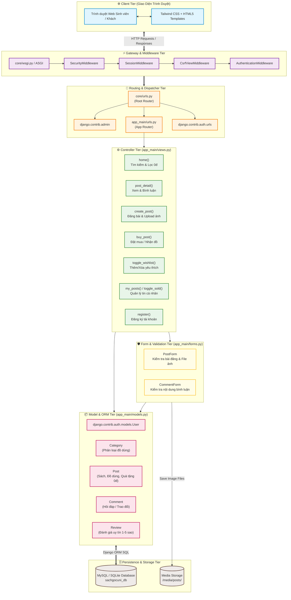
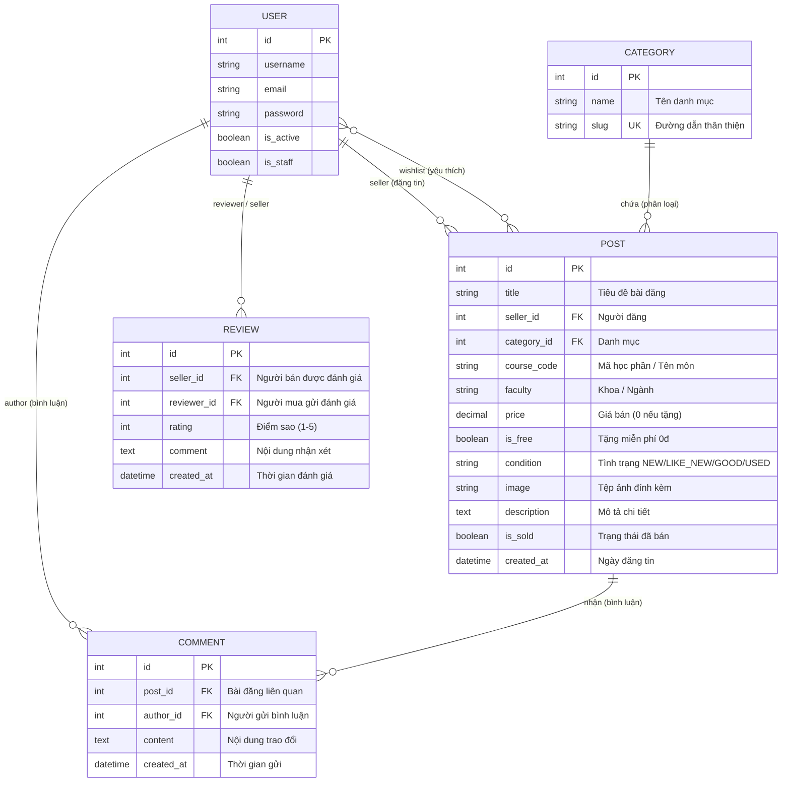
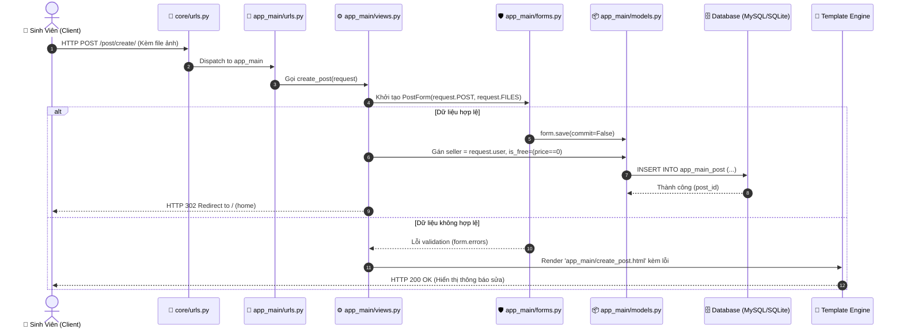

# 🏛️ Kiến Trúc Hệ Thống SáchGóc Uni (System Architecture)

> **Tài liệu đặc tả kiến trúc phần mềm, luồng dữ liệu và thiết kế thành phần dành cho GitDiagram và các công cụ trực quan hóa mã nguồn.**

---

## 1. Tổng Quan Kiến Trúc (Architecture Overview)

Hệ thống **SáchGóc Uni** được xây dựng theo mô hình kiến trúc phân lớp chuẩn **Django MVT (Model - View - Template)** mở rộng, kết hợp cơ chế bảo mật xác thực session và phân quyền người dùng.

---

## 2. Sơ Đồ Quan Hệ Thực Thể (Entity Relationship Diagram - ERD)

---

## 3. Luồng Xử Lý Yêu Cầu (Request Lifecycle Sequence Diagram)

---

## 4. Bản Đồ Mã Nguồn & Chức Năng (Code Map)

| Đường Dẫn Tệp | Phân Lớp Kiến Trúc | Chức Năng & Trách Nhiệm Chính |
|---|---|---|
| [`core/settings.py`](file:///d:/24CT1-NGUYEN_VAN%20HAO/core/settings.py) | **Cấu hình (Config)** | Khai báo `INSTALLED_APPS`, thiết lập MySQL database, bảo mật, xác thực người dùng, Media & Static files. |
| [`core/urls.py`](file:///d:/24CT1-NGUYEN_VAN%20HAO/core/urls.py) | **Điều phối (Root Router)** | Định tuyến cấp gốc, phân phối tới `/admin/`, `app_main.urls`, `accounts/` và phục vụ media. |
| [`core/wsgi.py`](file:///d:/24CT1-NGUYEN_VAN%20HAO/core/wsgi.py) | **Cổng giao tiếp (Gateway)** | Điểm vào cho các Web Server chuẩn WSGI (Gunicorn, uWSGI). |
| [`app_main/models.py`](file:///d:/24CT1-NGUYEN_VAN%20HAO/app_main/models.py) | **Mô hình Dữ liệu (ORM)** | Định nghĩa các bảng `Category`, `Post`, `Comment`, `Review`, các mối quan hệ FK & M2M. |
| [`app_main/views.py`](file:///d:/24CT1-NGUYEN_VAN%20HAO/app_main/views.py) | **Điều khiển Logic (Controllers)** | Tiếp nhận yêu cầu HTTP, xử lý nghiệp vụ tìm kiếm, phân trang, đăng tin, mua hàng, yêu thích. |
| [`app_main/forms.py`](file:///d:/24CT1-NGUYEN_VAN%20HAO/app_main/forms.py) | **Xác thực Dữ liệu (Validation)** | Xử lý `PostForm`, tải lên file ảnh `Pillow`, xác thực `CommentForm`. |
| [`app_main/urls.py`](file:///d:/24CT1-NGUYEN_VAN%20HAO/app_main/urls.py) | **Định tuyến (App Router)** | Khai báo các endpoint con trong ứng dụng chính. |
| [`app_main/admin.py`](file:///d:/24CT1-NGUYEN_VAN%20HAO/app_main/admin.py) | **Quản trị (Admin Panel)** | Giao diện quản trị viên: lọc tin, duyệt bài, khóa/mở khóa tài khoản sinh viên vi phạm. |
| [`app_main/tests.py`](file:///d:/24CT1-NGUYEN_VAN%20HAO/app_main/tests.py) | **Kiểm thử (Unit Tests)** | Kiểm tra tính đúng đắn của Models, Views, định tuyến HTTP. |
| [`seed_data.py`](file:///d:/24CT1-NGUYEN_VAN%20HAO/seed_data.py) | **Tiện ích Khởi tạo (Seeding)** | Tự động tạo danh mục và 15+ dữ liệu mẫu ban đầu để chạy thử nghiệm. |
| [`requirements.txt`](file:///d:/24CT1-NGUYEN_VAN%20HAO/requirements.txt) | **Quản lý Thư viện (Dependencies)** | Danh mục phiên bản các gói phần mềm cần thiết: Django, Pillow, MySQL drivers. |

---

## 5. Tương Thích Với GitDiagram

Để xem sơ đồ kiến trúc động và tương tác trực tiếp trên trình duyệt bằng GitDiagram:
- **URL GitDiagram:** `https://gitdiagram.com/Hao286/congnghephanmen`
- GitDiagram sẽ tự động quét cây thư mục, tệp cấu hình `requirements.txt`, tài liệu `ARCHITECTURE.md` và `README.md` để sinh ra sơ đồ kiến trúc trực quan, tương tác và nhấp được vào từng tệp mã nguồn.
