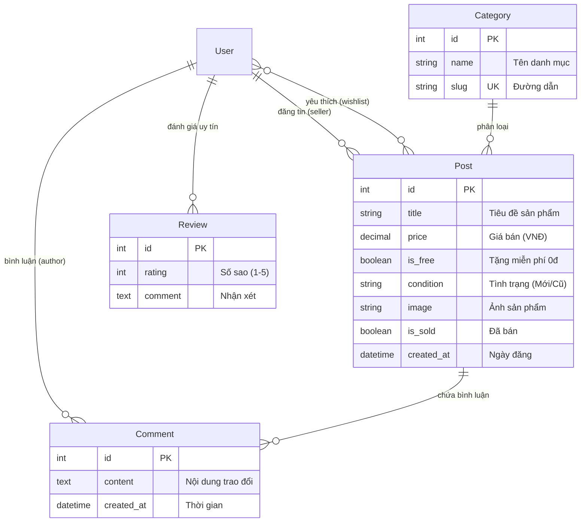

# 📚 SáchGóc Uni - Sàn Giao Dịch & Chia Sẻ Đồ Dùng Sinh Viên

[](https://gitdiagram.com/24CT1-NGUYENVANHAO/congnghephanmen)
[](https://www.djangoproject.com/)
[](https://www.python.org/)
[](https://tailwindcss.com/)
[](https://www.mysql.com/)

Dự án phát triển nền tảng web thương mại điện tử dành cho sinh viên trường Đại học Kiến trúc Đà Nẵng và cộng đồng sinh viên nói chung, hỗ trợ trao đổi, mua bán sách cũ, giáo trình và tặng đồ dùng học tập miễn phí (0đ).

> 💡 **Trực quan hóa Kiến trúc Dự án trên GitDiagram:** Bạn có thể xem và tương tác trực tiếp với sơ đồ kiến trúc mã nguồn của repository này tại: **[gitdiagram.com/24CT1-NGUYENVANHAO/congnghephanmen](https://gitdiagram.com/24CT1-NGUYENVANHAO/congnghephanmen)**

---

## 🏗️ 1. Sơ Đồ Phân Định Rõ Ràng Các Phần Trước - Sau Của Hệ Thống

GitHub và GitDiagram hỗ trợ hiển thị trực quan sơ đồ kiến trúc phân chia rành mạch giữa **Phần Trước (Frontend / Giao diện)** và **Phần Sau (Backend / Xử lý & Dữ liệu)**:

```mermaid
graph TD
    %% ==========================================
    %% PHẦN TRƯỚC: FRONTEND / GIAO DIỆN & CLIENT
    %% ==========================================
    subgraph FRONTEND ["🌐 PHẦN TRƯỚC (FRONTEND / CLIENT-SIDE)"]
        User([👤 Sinh viên / Khách truy cập])
        
        subgraph UI_Templates ["Bộ Giao diện & Templates (app_main/templates/)"]
            Tailwind["Tailwind CSS Framework"]
            BaseTpl["Khung trang chung<br/>(base.html)"]
            HomeTpl["Trang chủ & Lọc tin<br/>(home.html)"]
            DetailTpl["Chi tiết & Bình luận<br/>(detail.html)"]
            CreateTpl["Đăng tin & Upload ảnh<br/>(create_post.html)"]
            MyPostsTpl["Quản lý tin cá nhân<br/>(my_posts.html)"]
            AuthTpl["Đăng ký / Đăng nhập<br/>(login.html / register.html)"]
        end

        User <-->|Tương tác trực tiếp UI| Tailwind
        Tailwind --- BaseTpl
        BaseTpl --- HomeTpl & DetailTpl & CreateTpl & MyPostsTpl & AuthTpl
    end

    %% Giao tiếp giữa Phần Trước và Phần Sau qua HTTP
    FRONTEND ==>|1. Gửi HTTP Request (GET / POST Form)| BACKEND
    BACKEND ==>|6. Phản hồi HTTP Response (HTML / CSS hoàn chỉnh)| FRONTEND

    %% ==========================================
    %% PHẦN SAU: BACKEND / MÁY CHỦ, LOGIC & CSDL
    %% ==========================================
    subgraph BACKEND ["⚙️ PHẦN SAU (BACKEND / SERVER & DATABASE)"]
        
        %% Tầng 1: Cổng & Điều phối
        subgraph Routing_Layer ["1. Tầng Điều phối & Bảo mật"]
            Middleware["Django Middleware<br/>(Security, Session, CSRF Protection)"]
            RootRouter["core/urls.py<br/>(Bộ định tuyến cấp Dự án)"]
            AppRouter["app_main/urls.py<br/>(Bộ định tuyến cấp Ứng dụng)"]
            AdminRouter["django.contrib.admin<br/>(Bảng điều khiển Quản trị)"]

            Middleware --> RootRouter
            RootRouter --> AppRouter & AdminRouter
        end

        %% Tầng 2: Logic Nghiệp vụ & Xác thực
        subgraph Logic_Layer ["2. Tầng Điều khiển Logic (app_main/views.py)"]
            AuthLogic["Xác thực & Tài khoản<br/>(register, login, logout)"]
            PostLogic["Nghiệp vụ Đăng tin & Mua bán<br/>(home, post_detail, create_post, buy_post)"]
            SocialLogic["Tương tác xã hội & Uy tín<br/>(toggle_wishlist, my_posts, toggle_sold)"]
            AdminLogic["app_main/admin.py<br/>(Duyệt bài & Khóa tài khoản vi phạm)"]
        end

        %% Tầng 3: Biểu mẫu & Kiểm duyệt
        subgraph Form_Layer ["3. Tầng Kiểm tra Tính hợp lệ (app_main/forms.py)"]
            PostFormCheck["PostForm<br/>(Kiểm tra dữ liệu & File ảnh Pillow)"]
            CommentFormCheck["CommentForm<br/>(Kiểm duyệt nội dung bình luận)"]
        end

        %% Tầng 4: Mô hình Dữ liệu ORM
        subgraph ORM_Layer ["4. Tầng Mô hình Dữ liệu ORM (app_main/models.py)"]
            UserMod["User Model"]
            CatMod["Category Model"]
            PostMod["Post Model (Giá, 0đ, Trạng thái)"]
            CommentMod["Comment Model"]
            ReviewMod["Review Model (1-5 sao)"]
        end

        %% Tầng 5: Lưu trữ Vật lý
        subgraph Physical_Storage ["5. Tầng Lưu trữ Vật lý (Storage Tier)"]
            SQLDB[("🗄️ MySQL Database / SQLite<br/>(sachgocuni_db)")]
            MediaDir[("📁 Media Storage<br/>(/media/posts/)")]
        end

        %% Kết nối nội bộ Tầng Backend
        AppRouter --> Logic_Layer
        PostLogic & SocialLogic --> Form_Layer
        Form_Layer --> ORM_Layer
        Logic_Layer --> ORM_Layer
        AdminRouter --> AdminLogic
        AdminLogic --> ORM_Layer

        ORM_Layer <==>|Truy vấn SQL (ORM)| SQLDB
        Form_Layer ==>|Lưu file ảnh tải lên| MediaDir
    end

    %% Định nghĩa màu sắc phân biệt rõ ràng
    classDef fe fill:#e0f2fe,stroke:#0369a1,stroke-width:2px;
    classDef be fill:#f0fdf4,stroke:#15803d,stroke-width:2px;
    classDef logic fill:#fefce8,stroke:#a16207,stroke-width:2px;
    classDef form fill:#faf5ff,stroke:#7e22ce,stroke-width:2px;
    classDef storage fill:#fff1f2,stroke:#be123c,stroke-width:2px;

    class User,Tailwind,BaseTpl,HomeTpl,DetailTpl,CreateTpl,MyPostsTpl,AuthTpl fe;
    class Middleware,RootRouter,AppRouter,AdminRouter be;
    class AuthLogic,PostLogic,SocialLogic,AdminLogic logic;
    class PostFormCheck,CommentFormCheck form;
    class UserMod,CatMod,PostMod,CommentMod,ReviewMod logic;
    class SQLDB,MediaDir storage;
```

### 🧩 Architectural Components & File Mapping (Bản đồ thành phần cho GitDiagram)

Hệ thống được cấu trúc thành các module rõ ràng tương ứng trực tiếp với cây mã nguồn:

- **1. Presentation / Frontend Layer**: [`app_main/templates/`](app_main/templates/) - Giao diện người dùng sinh viên với Tailwind CSS và Django Templates (`base.html`, `home.html`, `detail.html`, `create_post.html`, `my_posts.html`, `login.html`, `register.html`).
- **2. Routing & Dispatcher Layer**: [`core/urls.py`](core/urls.py) và [`app_main/urls.py`](app_main/urls.py) phân phối và điều hướng HTTP requests từ Client đến các Views xử lý.
- **3. Controller & Business Logic**: [`app_main/views.py`](app_main/views.py) trung tâm điều khiển logic: xác thực tài khoản, tìm kiếm bài đăng, lọc đồ 0đ, xem chi tiết, đăng tin, mua hàng, yêu thích wishlist, bình luận.
- **4. Form & Data Validation**: [`app_main/forms.py`](app_main/forms.py) thẩm định tính hợp lệ của dữ liệu đầu vào và tiếp nhận file ảnh sản phẩm (`PostForm`, `CommentForm`).
- **5. Data Models & ORM**: [`app_main/models.py`](app_main/models.py) định nghĩa các thực thể và mối quan hệ CSDL (`User`, `Category`, `Post`, `Comment`, `Review`).
- **6. Administration & Moderation**: [`app_main/admin.py`](app_main/admin.py) hệ thống quản trị: kiểm duyệt tin đăng, khóa/mở khóa tài khoản sinh viên.
- **7. Database & Media Storage**: CSDL MySQL / SQLite (`sachgocuni_db`) cùng thư mục lưu trữ ảnh thực tế [`media/posts/`](media/posts/).
- **8. Mock Data & Utilities**: [`seed_data.py`](seed_data.py) script khởi tạo sẵn 15+ dữ liệu mẫu sinh động.
- **9. Automated Testing**: [`app_main/tests.py`](app_main/tests.py) bộ kiểm thử tự động cho Models và Views.

---

## 📊 2. Sơ Đồ Thực Thể Cơ Sở Dữ Liệu (ERD)



---

## 📁 3. Cấu Trúc Thư Mục Dự Án (Project Structure)

```text
24CT1-NGUYEN_VAN HAO/
├── core/                       # Cấu hình dự án Django cấp cao nhất
│   ├── settings.py             # Cài đặt ứng dụng, Database, Media, Static
│   ├── urls.py                 # Điều phối URL gốc (Admin, App, Auth)
│   ├── wsgi.py                 # Cổng giao tiếp Web Server chuẩn WSGI
│   └── asgi.py                 # Cổng giao tiếp Asynchronous ASGI
├── app_main/                   # Ứng dụng chính của nền tảng SáchGóc Uni
│   ├── models.py               # Thực thể CSDL: Category, Post, Comment, Review
│   ├── views.py                # Xử lý logic Controller (Trang chủ, Chi tiết, Đăng tin...)
│   ├── forms.py                # Form xử lý dữ liệu và tải file ảnh (PostForm, CommentForm)
│   ├── urls.py                 # Định tuyến các trang chức năng của ứng dụng
│   ├── admin.py                # Quản trị viên Django: duyệt bài, khóa tài khoản vi phạm
│   ├── apps.py                 # Khai báo thông tin ứng dụng
│   ├── tests.py                # Bộ Unit Tests tự động kiểm tra Models & Views
│   ├── migrations/             # Lịch sử đồng bộ cấu trúc Database
│   └── templates/              # Giao diện HTML tích hợp Tailwind CSS
│       ├── app_main/           # base.html, home.html, detail.html, create_post.html, my_posts.html
│       └── registration/       # login.html, register.html
├── media/                      # Thư mục chứa hình ảnh sản phẩm người dùng upload
│   └── posts/
├── seed_data.py                # Script tự động tạo 15+ dữ liệu mẫu ban đầu
├── requirements.txt            # Danh sách các thư viện Python cần thiết
├── ARCHITECTURE.md             # Đặc tả chi tiết cấu trúc hệ thống cho GitDiagram
├── manage.py                   # Script quản lý dòng lệnh của Django
└── README.md                   # Tài liệu hướng dẫn dự án
```

---

## 🚀 4. Hướng Dẫn Cài Đặt & Khởi Chạy

### Bước 1: Cài đặt các thư viện cần thiết
```bash
pip install -r requirements.txt
```

### Bước 2: Khởi tạo Cơ sở dữ liệu
Đảm bảo dịch vụ MySQL (XAMPP/MySQL Server) đang bật tại cổng `3307` (hoặc cấu hình lại trong [`core/settings.py`](file:///d:/24CT1-NGUYEN_VAN%20HAO/core/settings.py)):
```bash
python manage.py makemigrations
python manage.py migrate
```

### Bước 3: Nạp dữ liệu mẫu ban đầu (Demo Data)
```bash
python seed_data.py
```
> Script sẽ tự động tạo tài khoản mẫu `sinhvien_demo` (mật khẩu: `123456`) cùng với các danh mục và sản phẩm mẫu sinh động.

### Bước 4: Khởi động Server
```bash
python manage.py runserver
```
Truy cập hệ thống tại: **`http://127.0.0.1:8000/`**

---

## 🌟 5. Các Tính Năng Nổi Bật
- 📖 **Mua bán & Trao đổi:** Đăng bán giáo trình, dụng cụ vẽ kỹ thuật, thiết bị điện tử giá rẻ.
- 🎁 **Tặng đồ dùng 0đ:** Chuyên mục dành riêng cho sinh viên khóa trên tặng lại đồ cho tân sinh viên.
- 🔍 **Tìm kiếm & Bộ lọc nhanh:** Lọc theo từng danh mục khoa ngành hoặc lọc nhanh đồ tặng miễn phí.
- 💬 **Hỏi đáp trực tiếp:** Tính năng bình luận ngay dưới bài đăng giúp người mua và người bán dễ dàng kết nối.
- ⭐ **Đánh giá uy tín & Wishlist:** Đánh giá điểm sao người bán và lưu lại các sản phẩm yêu thích.
- 🔒 **Quản trị toàn diện (Admin):** Kiểm duyệt bài đăng, gắn cờ sản phẩm và khóa/mở khóa tài khoản người dùng vi phạm.