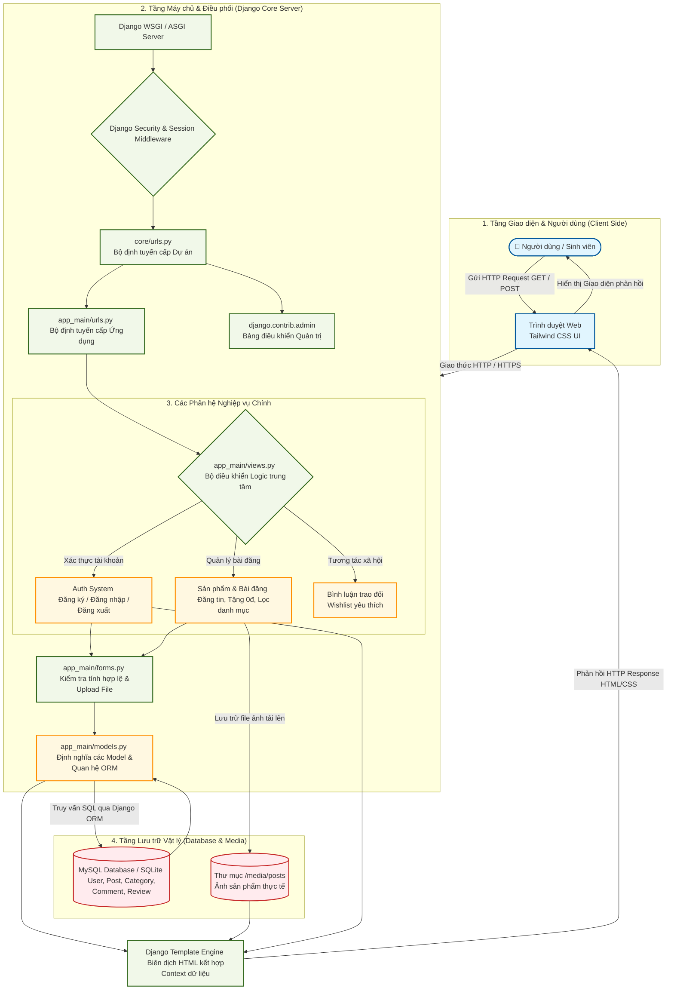
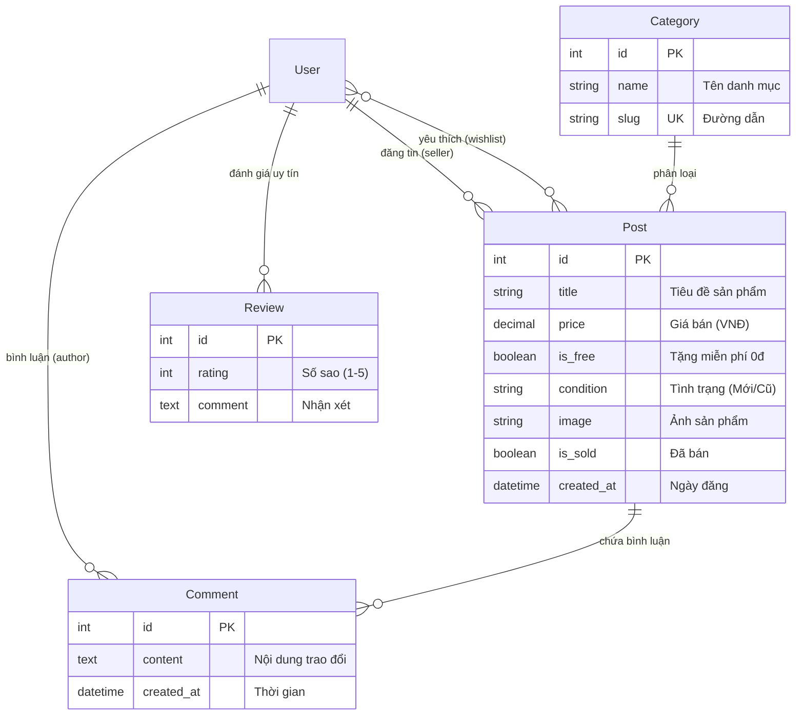

# 📚 SáchGóc Uni - Sàn Giao Dịch & Chia Sẻ Đồ Dùng Sinh Viên

[](https://gitdiagram.com/24CT1-NGUYENVANHAO/congnghephanmen)
[](https://www.djangoproject.com/)
[](https://www.python.org/)
[](https://tailwindcss.com/)
[](https://www.mysql.com/)

Dự án phát triển nền tảng web thương mại điện tử dành cho sinh viên trường Đại học Kiến trúc Đà Nẵng và cộng đồng sinh viên nói chung, hỗ trợ trao đổi, mua bán sách cũ, giáo trình và tặng đồ dùng học tập miễn phí (0đ).

> 💡 **Trực quan hóa Kiến trúc Dự án trên GitDiagram:** Bạn có thể xem và tương tác trực tiếp với sơ đồ kiến trúc mã nguồn của repository này tại: **[gitdiagram.com/24CT1-NGUYENVANHAO/congnghephanmen](https://gitdiagram.com/24CT1-NGUYENVANHAO/congnghephanmen)**

---

## 🏗️ 1. Sơ Đồ Kiến Trúc & Luồng Xử Lý Tổng Thể Hệ Thống

GitHub và GitDiagram hỗ trợ hiển thị trực quan sơ đồ kiến trúc chi tiết của dự án thông qua Mermaid:



---

## 📊 2. Sơ Đồ Thực Thể Cơ Sở Dữ Liệu (ERD)



---

## 📁 3. Cấu Trúc Thư Mục Dự Án (Project Structure)

```text
24CT1-NGUYEN_VAN HAO/
├── core/                       # Cấu hình dự án Django cấp cao nhất
│   ├── settings.py             # Cài đặt ứng dụng, Database, Media, Static
│   ├── urls.py                 # Điều phối URL gốc (Admin, App, Auth)
│   ├── wsgi.py                 # Cổng giao tiếp Web Server chuẩn WSGI
│   └── asgi.py                 # Cổng giao tiếp Asynchronous ASGI
├── app_main/                   # Ứng dụng chính của nền tảng SáchGóc Uni
│   ├── models.py               # Thực thể CSDL: Category, Post, Comment, Review
│   ├── views.py                # Xử lý logic Controller (Trang chủ, Chi tiết, Đăng tin...)
│   ├── forms.py                # Form xử lý dữ liệu và tải file ảnh (PostForm, CommentForm)
│   ├── urls.py                 # Định tuyến các trang chức năng của ứng dụng
│   ├── admin.py                # Quản trị viên Django: duyệt bài, khóa tài khoản vi phạm
│   ├── apps.py                 # Khai báo thông tin ứng dụng
│   ├── tests.py                # Bộ Unit Tests tự động kiểm tra Models & Views
│   ├── migrations/             # Lịch sử đồng bộ cấu trúc Database
│   └── templates/              # Giao diện HTML tích hợp Tailwind CSS
│       ├── app_main/           # base.html, home.html, detail.html, create_post.html, my_posts.html
│       └── registration/       # login.html, register.html
├── media/                      # Thư mục chứa hình ảnh sản phẩm người dùng upload
│   └── posts/
├── seed_data.py                # Script tự động tạo 15+ dữ liệu mẫu ban đầu
├── requirements.txt            # Danh sách các thư viện Python cần thiết
├── ARCHITECTURE.md             # Đặc tả chi tiết cấu trúc hệ thống cho GitDiagram
├── manage.py                   # Script quản lý dòng lệnh của Django
└── README.md                   # Tài liệu hướng dẫn dự án
```

---

## 🚀 4. Hướng Dẫn Cài Đặt & Khởi Chạy

### Bước 1: Cài đặt các thư viện cần thiết
```bash
pip install -r requirements.txt
```

### Bước 2: Khởi tạo Cơ sở dữ liệu
Đảm bảo dịch vụ MySQL (XAMPP/MySQL Server) đang bật tại cổng `3307` (hoặc cấu hình lại trong [`core/settings.py`](file:///d:/24CT1-NGUYEN_VAN%20HAO/core/settings.py)):
```bash
python manage.py makemigrations
python manage.py migrate
```

### Bước 3: Nạp dữ liệu mẫu ban đầu (Demo Data)
```bash
python seed_data.py
```
> Script sẽ tự động tạo tài khoản mẫu `sinhvien_demo` (mật khẩu: `123456`) cùng với các danh mục và sản phẩm mẫu sinh động.

### Bước 4: Khởi động Server
```bash
python manage.py runserver
```
Truy cập hệ thống tại: **`http://127.0.0.1:8000/`**

---

## 🌟 5. Các Tính Năng Nổi Bật
- 📖 **Mua bán & Trao đổi:** Đăng bán giáo trình, dụng cụ vẽ kỹ thuật, thiết bị điện tử giá rẻ.
- 🎁 **Tặng đồ dùng 0đ:** Chuyên mục dành riêng cho sinh viên khóa trên tặng lại đồ cho tân sinh viên.
- 🔍 **Tìm kiếm & Bộ lọc nhanh:** Lọc theo từng danh mục khoa ngành hoặc lọc nhanh đồ tặng miễn phí.
- 💬 **Hỏi đáp trực tiếp:** Tính năng bình luận ngay dưới bài đăng giúp người mua và người bán dễ dàng kết nối.
- ⭐ **Đánh giá uy tín & Wishlist:** Đánh giá điểm sao người bán và lưu lại các sản phẩm yêu thích.
- 🔒 **Quản trị toàn diện (Admin):** Kiểm duyệt bài đăng, gắn cờ sản phẩm và khóa/mở khóa tài khoản người dùng vi phạm.